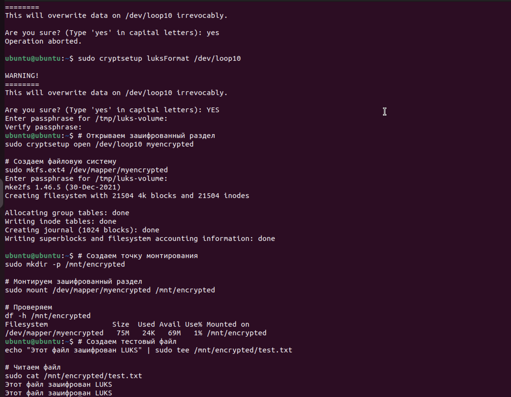

# Домашнее задание к занятию «Защита хоста»  
**Выполнил:** Гридин Владимир

---

## Задание 1. Установка и настройка eCryptfs

### 1.1 Установка eCryptfs

```bash
sudo apt update
sudo apt install ecryptfs-utils
```

### 1.2 Добавление пользователя cryptouser

```bash
sudo adduser cryptouser
```

### 1.3 Шифрование домашнего каталога

```bash
sudo ecryptfs-migrate-home -u cryptouser
```

⚠️ Важно: После выполнения команды нужно перезайти под пользователем cryptouser, чтобы завершить процесс шифрования.

Скриншоты


Домашний каталог после шифрования


## Задание 2. LUKS-шифрование раздела

### 2.1 Установка необходимых пакетов

```bash
sudo apt update
sudo apt install cryptsetup -y
```

### 2.2 Создание раздела 100 Мб

Пример: создание файла-раздела и подключение через loop-устройство

```bash
# Создаем файл размером 100 МБ
dd if=/dev/zero of=/tmp/luks-volume bs=1M count=100

# Проверяем свободные loop-устройства
sudo losetup -f

# Подключаем файл как блочное устройство
sudo losetup /dev/loop10 /tmp/luks-volume

# Проверяем подключение
sudo losetup -a | grep loop10
```

### 2.3 Шифрование раздела LUKS

```bash
# Форматируем раздел как LUKS
sudo cryptsetup luksFormat /dev/loop10

# Открываем зашифрованный раздел
sudo cryptsetup open /dev/loop10 myencrypted

# Создаем файловую систему на зашифрованном разделе
sudo mkfs.ext4 /dev/mapper/myencrypted
```

### 2.4 Монтирование и проверка

```bash
# Создаем точку монтирования
sudo mkdir -p /mnt/encrypted

# Монтируем зашифрованный раздел
sudo mount /dev/mapper/myencrypted /mnt/encrypted

# Проверяем размер и точку монтирования
df -h /mnt/encrypted

# Проверяем статус LUKS устройства
sudo cryptsetup status myencrypted
```

### 2.5 Тестирование работы с зашифрованным разделом

```bash
# Создаем тестовый файл
echo "Тестовые данные в зашифрованном разделе" | sudo tee /mnt/encrypted/test-file.txt

# Проверяем содержимое
sudo cat /mnt/encrypted/test-file.txt

# Проверяем список файлов
sudo ls -la /mnt/encrypted/
```

### 2.6 Размонтирование и закрытие раздела

```bash
# Размонтируем раздел
sudo umount /mnt/encrypted

# Закрываем LUKS устройство
sudo cryptsetup close myencrypted

# Отключаем loop-устройство
sudo losetup -d /dev/loop10
```
### 2.7 Проверка повторного доступа

Подключаем loop-устройство снова

```bash

sudo losetup /dev/loop10 /tmp/luks-volume
```

Пытаемся получить доступ без пароля (должно не получиться)

```bash
sudo mount /dev/loop10 /mnt/encrypted 2>&1 | head -3
```
Открываем LUKS с паролем
```bash
sudo cryptsetup open /dev/loop10 myencrypted
```

Монтируем и проверяем данные

```bash
sudo mount /dev/mapper/myencrypted /mnt/encrypted
sudo cat /mnt/encrypted/test-file.txt
```

### 2.8 Очистка после тестирования

Размонтируем и закрываем
```bash
sudo umount /mnt/encrypted
sudo cryptsetup close myencrypted
sudo losetup -d /dev/loop10
```

Удаляем тестовый файл
```bash
sudo rm /tmp/luks-volume
```
Удаляем точку монтирования
```bash
sudo rmdir /mnt/encrypted
```

Скиншот


